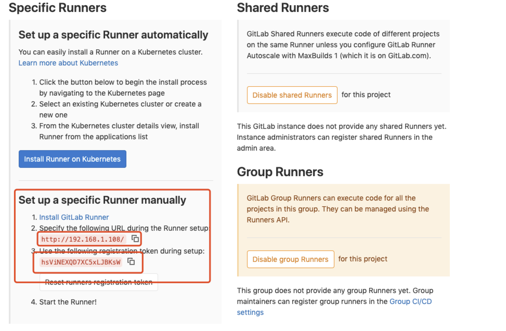

# gitlab-ci

gitlab-ci runner的基本配置方法（mac版本）

## 持续集成
CI，Continuous Integration，持续集成，是软件开发过程中一个非常重要的环节，在互联网敏捷开发的过程中，持续集成通常用来进行日常编译和自动化测试，来保证及时发现提交的问题，避免影响项目进度。

通常持续集成的过程包括：

* 提交（合并）代码
* 编译
* 测试
* 发布
不同的项目可能步骤有所不同，一些更加规范的公司的项目可能会加入静态代码检查，也有不少的小项目迫于进度和QA的工作压力，可能连测试过程都没有


## 持续集成工具

CI工具有很多，目前最为常用应该是Jenkins。Jenkins通常包括一个master和很多个slave。master用于配置和组织节点、任务，slave则用来真正执行配置好的任务。因为用户群体的庞大，Jenkins上的各种插件，尤其是很多可视化插件都非常丰富，可以帮助很多新手快速配置所需的任务。

gitlab-ci是git官方的持续集成工具，在Git工程管理页面上，也有专门的CI配置和展示页。

以上都是从网上借鉴的， 下面开始手把手的操作， 准备好，要开始了。。。

**自己尝试用docker搭建了`gitlab-ce` 来跑 `gitlab-runner`**

另外用docker搭建了一套jenkins, 实现自动构建

## gitlab-runner 安装

1. Homebrew 安装

```
  brew install gitlab-runner
```
用户权限不够的使用
```
  sudo brew install gitlab-runner
```

2. 官方：Gitlab runner 10以上安装方式，若安装旧版本前往官网查看

```
  sudo curl --output /usr/local/bin/gitlab-runner https://gitlab-runner-downloads.s3.amazonaws.com/latest/binaries/gitlab-runner-darwin-amd64

  设置权限

  sudo chmod +x /usr/local/bin/gitlab-runner
```

以上就下载安装好了

使用
```
  gitlab-runner status
```

查看状态

相关操作命令

```
  gitlab-runner --help
```

查看已注册的runner
```
  gitlab-runner list
```

## 开始注册runner



1. 执行
```
  gitlab-runner register
```

2. git的URL

```
  Please enter the gitlab-ci coordinator URL (e.g. https://gitlab.com )
  http://192.168.1.108/
```

3. gitlab-runner 的token

```
  Please enter the gitlab-ci token for this runner
  hsViNEXQD7XC5xLJBKsW
```

4. runner 的名字

```
Please enter the gitlab-ci description for this runner:
[hostame] test-runner
```

5. 关联git和runner的tag

```
  Please enter the gitlab-ci tags for this runner (comma separated):
  test-tags
```

6. runner的执行环境 （executor）
  朕尝试了用shell、docker

```
  Please enter the executor: ssh, docker+machine, docker-ssh+machine, kubernetes, docker, parallels, virtualbox, docker-ssh, shell:
  shell (Mac可以在本机器上运行)
```

**若选择docker，则需要下一步**

7. docker 的默认 image

```
  Please enter the Docker image (eg. ruby:2.1):
  node
```

可在 .gitlab-ci.yml 指定新的 image
```
  image: node:latest
```

此时此刻， 相信已经注册完成一个runner
通过 ` 通过vi ~/.gitlab-runner/config.toml ` 打开runner 的配置文件看到之前配置的内容。

### 启动

```
  cd ~
  gitlab-runner install
  gitlab-runner start
```

执行成功后， 在Runners settings会显示runner的状态，显示为绿色，则runner配置成功。

## 大功告成 ୧(๑•̀◡•́๑)૭


## 下面贴上自己调试 `runner` 用的 `.gitlab-ci.yml`
见笑了😆

```
# image: daocloud.io/baidao/web-deploy:v1.0
#image: node

stages:
  - testRunnerShell
  - testRunnerDocker

# 缓存node_modules
cache:
  paths:
  - node_modules

# before_script:
  # - yarn

testRunnerShell:
  tags:
    - test-runner-tags
    # - local-shell-tags
    # - local-shell-sudo-tags
  stage: testRunnerShell
  script:
    - echo "test runner starting ----> shell"
    - pwd
    - echo $PATH
    - node -v
    - npm -v
    - npx -v
    - yarn -v 
    - yarn install
    - yarn build
  only:
    - master


testRunnerDocker:
  tags:
    - test-runner-docker-tags
  stage: testRunnerDocker
  script:
    - echo test runner starting ----> docker
    - yarn -v
    - npm -v
  only:
    - test
```


